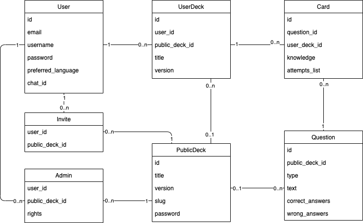

# Documentation

## User Guide

### Telegram bot

### Web version

## Schemas

The class diagram of the models:

As we can see on the schema, there are 7 entities in the project:
* User
    * _**id**_
    * _**email**_
    * _**username**_
    * **password** hash (password must match security rules)
    * preferred language (the default is set according to the context, but may be changed)
    * _chat_id_ for telegram bot
* UserDeck
    * _**id**_
    * **user_id** (M-O to User)
    * public_deck_id (M-O to PublicDeck)
    * _**title**_ (unique in user's namespace)
    * **version** (default is -1, when shared or cloned, matches the version of the PublicDeck)
* Card
    * _**id**_
    * **question_id** (M-O to Question)
    * **user_deck_id** (M-O to UserDeck)
    * **knowledge** (integer value demonstrating user's knowledge of the card)
    * **attempts_list** (format `success`:`timestamp`, e.g. `T:32183901`)
* Question
    * _**id**_
    * public_deck_id (M-O to PublicDeck)
    * **type** (integer value indicating type)
    * **text** (integer value demonstrating user's knowledge of the card)
    * **correct_answers**
    * **wrong_answers**
* PublicDeck
    * _**id**_
    * **title**
    * **version** (integer value indicating type)
    * _**slug**_ (integer value demonstrating user's knowledge of the card)
    * **password** hash if the access must be limited 
* Invite is an invitation link for a User to join the PublicDeck
    * **user_id**
    * **public_deck**
* Admin is a connector table to allow User administrate PublicDeck 
    * **user_id**
    * **public_deck**
    * rights
    
**not null**  
_unique_

## Release story