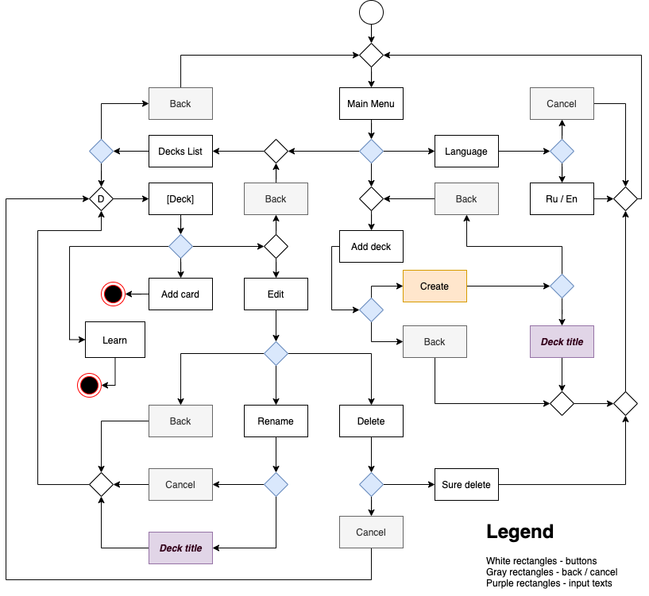
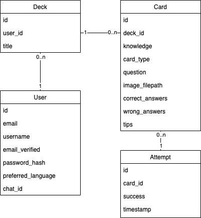

# Documentation

## User Guide

### Telegram bot
After starting the conversation with the bot using /start, it sends a message with an
inline keyboard button with link to the sign in page. After clicking the button the user
first signs up a new account and bot sends start message offering to create a new deck.

The overall interface is based on telegram inline keyboard markups and only if the input
text is expected, user has to type words.

##### Bot UI activity diagram
 

### Web version
The web version currently supports only auth page, so other pages such as profile 
and home are empty.

## Schemas

The class diagram of the models:

As we can see on the schema, there are 4 entities in the project:
* User
    * _**id**_
    * _**email**_
    * _**username**_
    * **password_hash** (password must match security rules)
    * email_verified
    * preferred language (the default is set according to the context, but may be changed)
    * inline_keyboard_id (we try to keep only one message in every telegram chat)
    * _chat_id_ for telegram bot
* Deck
    * _**id**_
    * **user_id** (M-O to User)
    * _**title**_ (unique in user's namespace)
* Card
    * _**id**_
    * **deck_id** (M-O to Deck)
    * **card_type**
    * **question**
    * _image_filepath_
    * **knowledge** (integer value determining user's knowledge of the card)
    * correct_answers
    * wrong_answers
    * tips
* Attempt
    * _**id**_
    * **success**
    * **timestamp**
    * **card_id**

    
**not null**  
_unique_

## Release story